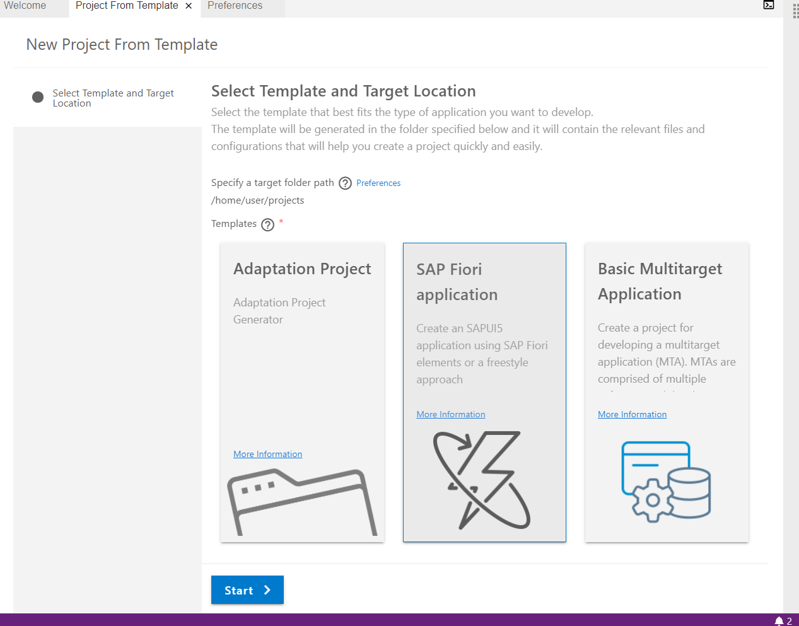
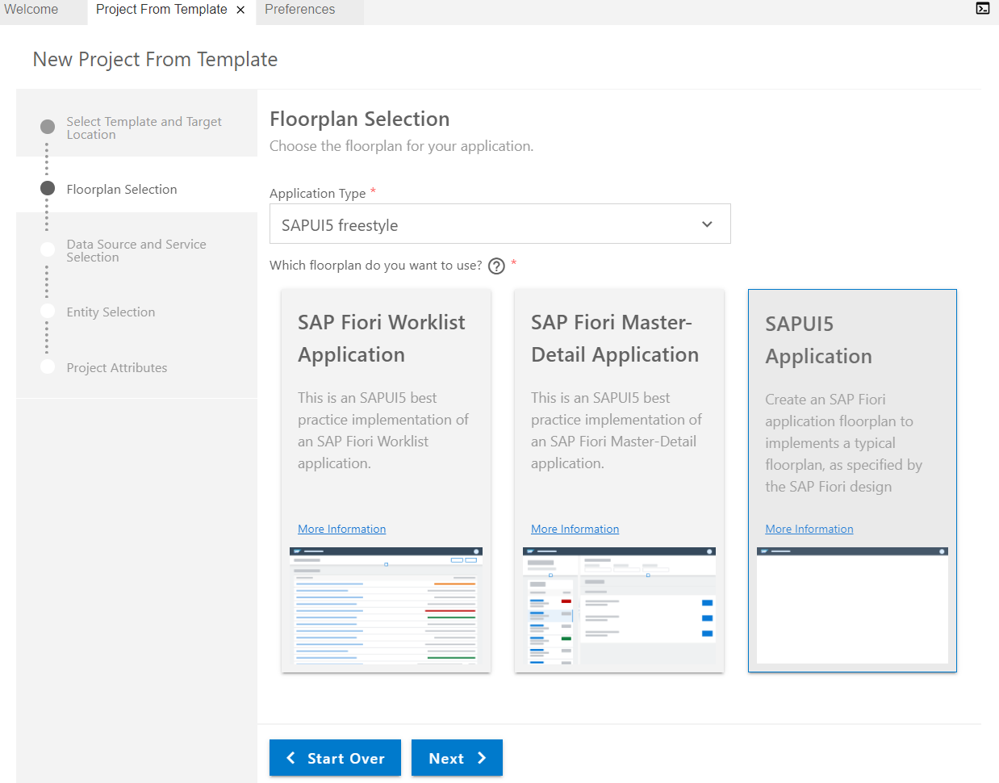
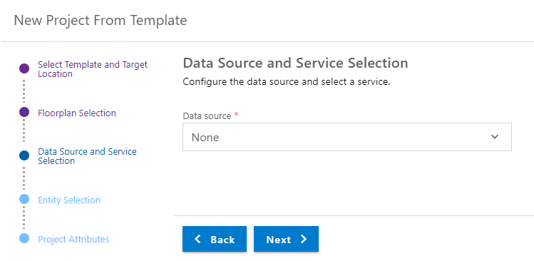
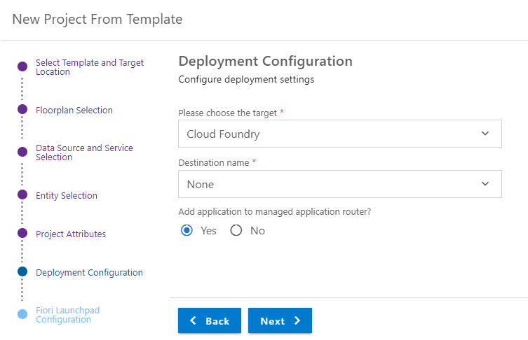
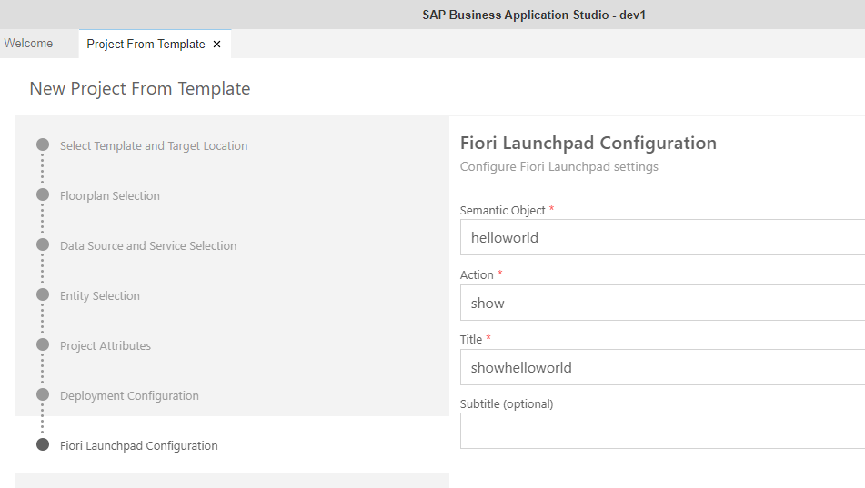
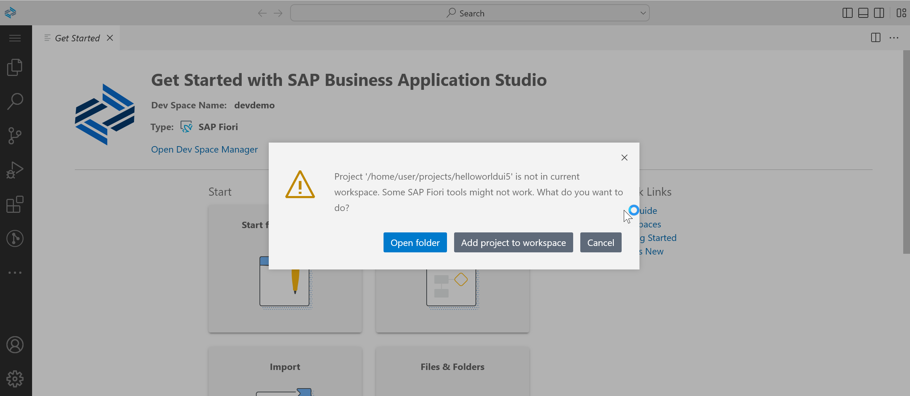
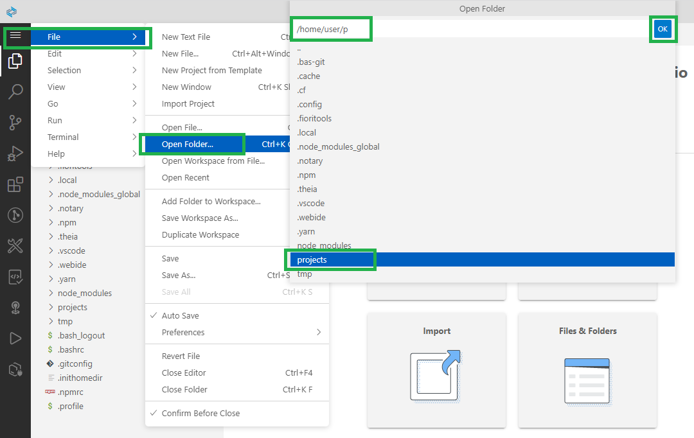

**Create an SAP Fiori Application with "Start from template"**

1. Click on <strong>Start from template</strong> in the Welcome tab to create the project.
Alternative: Open the menu in the top left corner and go to <strong>View > Command Palette ...</strong> and search for ">new project". Select the command <strong>SAP Business Application Studio: New Project from Template</strong> 

2. In the New Project Wizard select **SAP Fiori Application**.</li> 

Click <strong>Start</strong>.

3. In the <strong>Floorplan Selection</strong> choose the following:</li>

For the field <strong>Application Type</strong> choose <strong>SAPUI5 freestyle</strong> from the drop-down.
Select <strong>SAPUI5 Application</strong> as floorplan.

Choose <strong>Next</strong>.

4. In the <strong>Data Source and Service Selection</strong> choose <strong>None</strong> for Data source, because we just create a "Hello World" without data binding.

5. Choose <strong>Next</strong>.

6. Under <strong>Entity Selection</strong> name your SAPUI5 view. This name will appear in the launchpad service for the app. We keep <code>"View1"</code> for now

Choose <strong>Next</strong>

7. In the next step, <strong>Project Attributes</strong> choose names and a description for your "Hello World" app (examples see figure):

Module name <code>helloworldui5 </code>
Application title <code>Hello World App Title </code>
Application namespace <code>sap.btp </code>
Description: <code>A Fiori Hello World application  </code>

<strong>Project folder path</strong> and <strong>Minimum SAPUI5 version</strong> should not be changed

Add deployment configuration to MTA project <code>Yes </code> 
Add FLP configuration <code>Yes</code> 
Configure advanced options <code>No</code> 

Choose <strong>Next</strong>.

8. In the next step, <strong>Deployment Configuration</strong> choose <strong>Cloud Foundry</strong> as a target.</li> 

Choose <code>None</code> for Destination name.

Choose <strong>Add application to managed application router?</strong> <code>Yes</code>.
This is the standard html5 repository from launchpad service and eases deployment.

Choose <strong>Next</strong>

     

9. The launchpad service needs some Fiori Launchpad Configuration data about the app. Choose names for the entries Semantic Object, Action, and Title (examples see figure)</li> 
(Optional: For more information about these data and features, see Intent-Based Navigation in a Nutshell).  

Semantic Object: <code>helloworld </code> 
Action: <code>show </code> 
Title: <code>showhelloworld </code>  

     

10. Choose <strong>Finish</strong></li> 

*Note*, that it may take some time until all dependencies are installed.

11. Click on <strong>Add Project to Workspace</strong></li> 

     

12. After your App is generated, you should see this page and in the Explorer a new folder "helloworldui5" under HOME.</li> 

     

13. Open your Projects folder via menu: File > Open Folder ... and enter "/home/user/projects".</li> 

     
 
14. Click <strong>OK</strong>.</li>

